# 用 Visual Studio Code 在 macOS 或 Linux 上创建首个 ASP.NET Core 应用程序

翻译：[刘怡(AlexLEWIS)](http://github.com/alexinea)、[赵志刚](https://github.com/rdzzg)

本文将展示如何在 macOS 或 Linux 平台上创建首个 ASP.NET Core 应用程序。

## 配置开发环境

下载并安装 [.NET Core](https://microsoft.com/net/core) 和 [Visual Studio Code](https://code.visualstudio.com)，以及 [C# 扩展](https://marketplace.visualstudio.com/items?itemName=ms-vscode.csharp)。

## 使用 dotnet new 的脚手架来新建应用

我们使用 `dotnet new` 并使用「Empty Web Template」创建新应用程序。为项目创建一个工作目录，取名为 *firstapp*，并用 `cd` 命令进入该文件夹。

启动 Visual Studio Code，打开 *firstapp* 文件夹。点击 Ctrl + '\`'（反引号）来打开 VS Code 内集成的终端。当然也可以选择使用单独的终端窗口。

运行 `dotnet new` 命令创建 Web 应用程序，传递 `mvc` 参数作为模板类型。


```console
dotnet new mvc
```

如果在运行 `dotnet new mvc` 时出现错误，安装最新版的 [.NET Core](https://microsoft.com/net/core)。当 CLI 命令完成，会生成下列输出和文件。

```console
Content generation time: 79.6691 ms
The template "Empty ASP.NET Core Web Application" created successfully.
```
<!-- the ~ format is perferred but not working on DocFX. It does work on OPS. See bug https://mseng.visualstudio.com/DefaultCollection/VSChina/_workitems#_a=edit&id=959814
[!INCLUDE[template files](~/includes/template-files.md)]
-->

[!INCLUDE[template files](../includes/template-files.md)]

## 在 macOS 和 Linux 上使用 Visual Studio Code 开发 ASP.NET 应用程序

在 Visual Studio Code（VS Code）打开项目文件夹，然后选择 *Startup.cs* 文件。VS Code 将立即还原（restore）项目所需的依赖项，并添加生成/调试依赖项。点击 **Yes** 添加生成和调试资源，然后点击 **Restore** 来还原项目依赖。

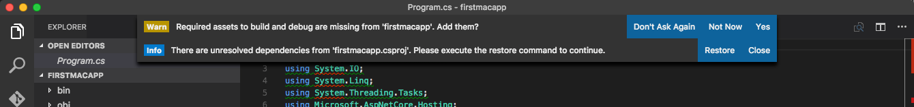

**Restore** 时，可以在终端运行 `dotnet restore` 或是在 VS Code 中输入 `⌘⇧P` 或 `Ctrl+Shift+P`，然后键入 `.NET`，如下所示：

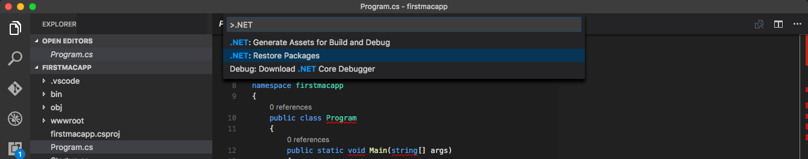

VS Code 为工作文件和生产代码环境提供了流畅简洁的界面。

左侧导航栏中的四个图标分别代表五种功能：

* 资源管理器
* 搜索
* Git
* 调试
* 扩展

资源管理器视图提供了文件导航与已开文件视图。它会使用一个符号来表示未保存变更的文件。在该视图中可以创建文件和文件夹。如果鼠标经过菜单项，**全部保存（Save All）**按钮就会出现，点击即可保存全部变更。

搜索视图允许在已开文件的目录树下搜索文件名及内容。

如果你电脑已安装 Git，那么 *VS Code* 将直接集成 Git，你可以在 Git 视图中初始化一个新仓库，提交（Commit）并推送（Push）变更。

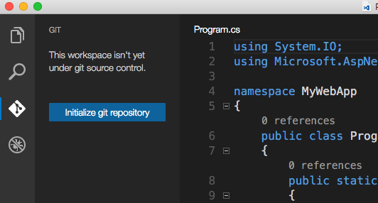

调试视图支持为应用程序进行交互式调试。

VS Code 的编辑器还提供了一些非常出色的特性，比如你会注意到未使用的 using 语句会带有下划线，当出现电灯图标时可使用 `⌘ .` 或 `Ctrl + .` 自动移除之。类和方法同样可显示本项目中的引用次数。

关于编辑器的资料可以在 [Visual Studio Code](https://code.visualstudio.com) 上查阅。

## 使用 VS Code 调试器

本示例配置使用 [Kestrel](../fundamentals/servers/kestrel.md) 作为 Web 服务器。

在调试器中运行应用：

* 在左侧点击调试图标

* 点击「Play (F5)」图标启动应用

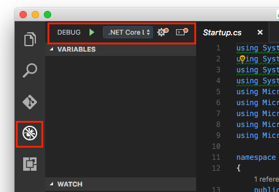

默认浏览器自动启动并访问 `http://localhost:5000`

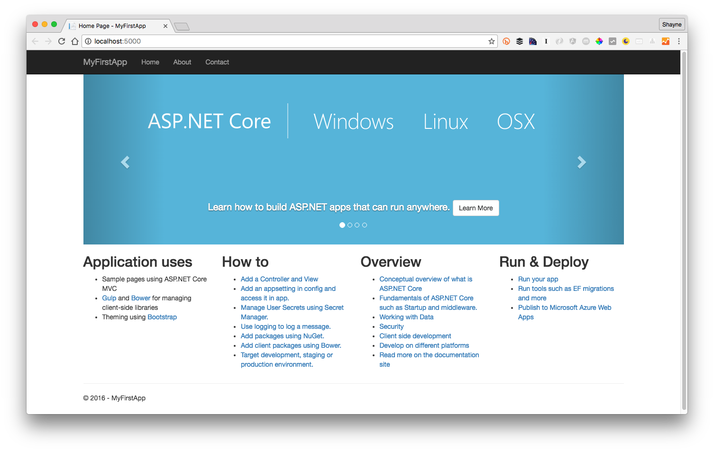

* 关闭浏览器并在调试栏中点击「Stop」图标，应用停止运行。

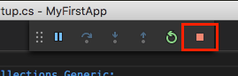

### 使用 dotnet 指令

* 在终端或 bash 上运行 `dotnet run` 指令启动应用。

* 浏览器中访问 `http://localhost:5000`

* 通过 `⌃+C` 或 `Ctrl+C` 停止 web 服务器。

## 发布到 Azure

VS Code 提供了 Git 的集成，可用来提送更新到托管于[Microsoft Azure](http://azure.microsoft.com)的生产环境。

### 初始化 Git

为你的工作文件夹初始化 GIT。切换到Git视图 然后点击 `Initialize Git repository` 按钮。

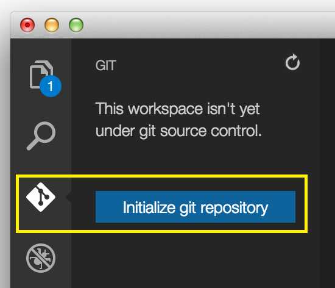

填写提交信息并点击提交，或点击复选框来提交暂存文件。


Git 会跟踪变更，所以如果你更新了文件，Git视图将显示上次提交之后修改过的文件。

### 初始化 Azure 网站

你可以直接通过 Git 来部署 Azure Web Apps。

* 若你没有 Azure 账号，你可以[免费试用](http://azure.microsoft.com/en-us/pricing/free-trial/).

在 Azure 门户中添加一个 Web App 用于托管你的新应用。

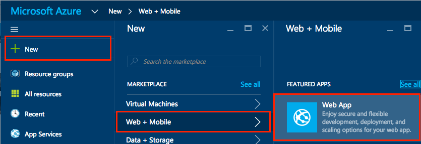

在 Azure 中配置 Web App 以便[利用 Git 持续部署](https://azure.microsoft.com/zh-cn/documentation/articles/app-service-deploy-local-git/).

从 Azure 门户的 Web App 上记下 Git URL。

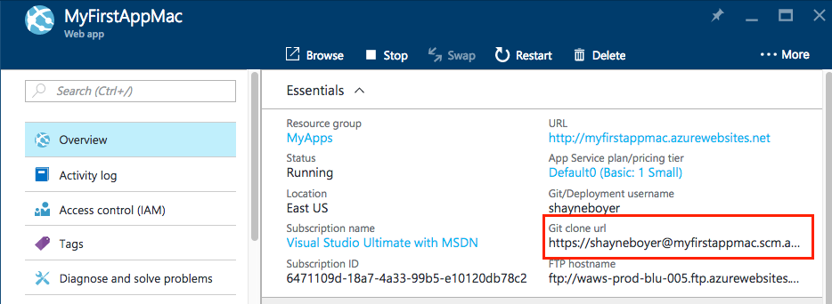

在终端窗口，用你之前记下的 Git URL 创建一个新的名为 `azure` 的远成仓库。

`git remote add azure https://shayneboyer@myfirstappmac.scm.azurewebsites.net:443/MyFirstAppMac.git`

推送（Push）到 master 分支，用 `git push azure master` 部署。

   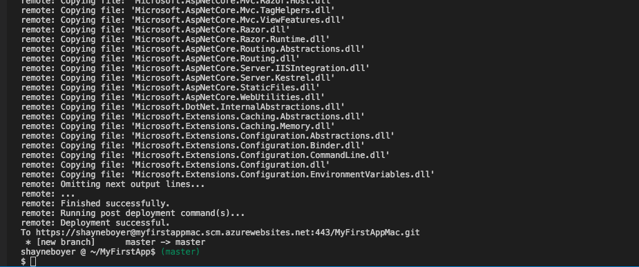

浏览新发布的网络应用

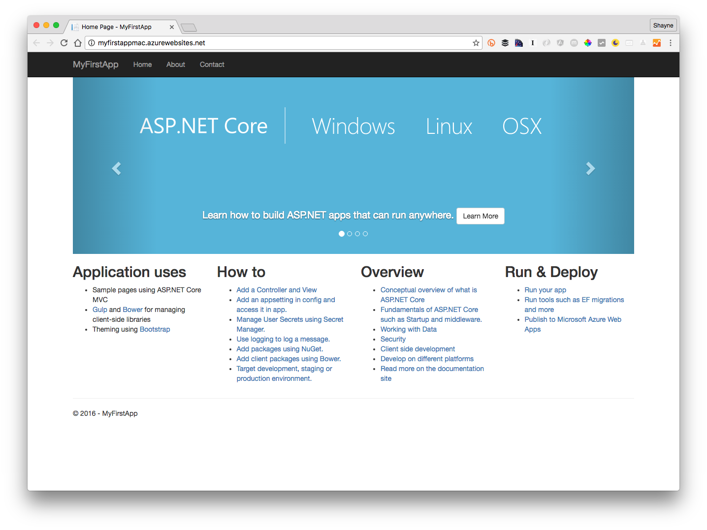

在 Azure 门户上查看部署详情（Deployment Details），你可以看到分支提交的每一个步骤和日志。

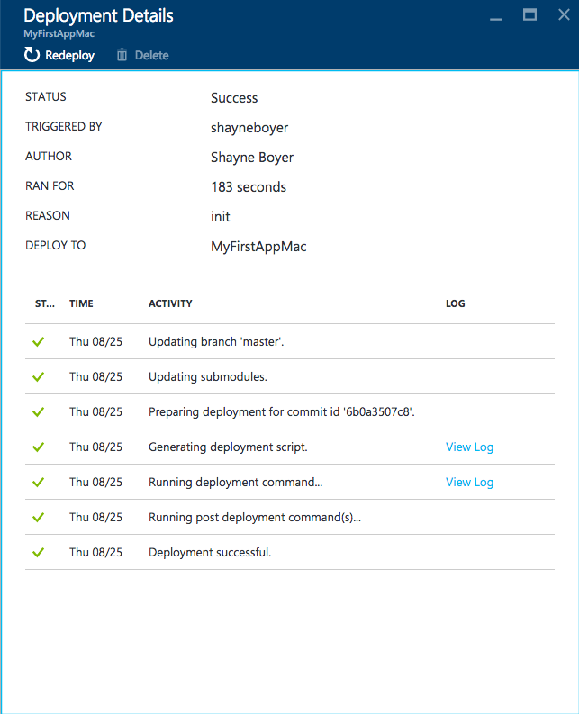

## 更多信息

* [Visual Studio Code](https://code.visualstudio.com)
* [基本原理](../fundamentals/index.md)
